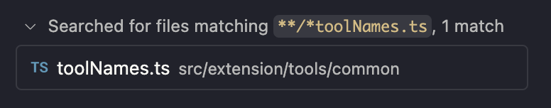
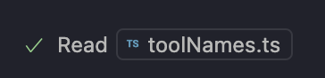

## So you want to write a tool

New to LLM tools? Here are some starting resources
- https://code.visualstudio.com/api/extension-guides/tools
- https://docs.anthropic.com/en/docs/build-with-claude/tool-use/overview
- https://platform.openai.com/docs/guides/function-calling?api-mode=chat
- https://www.anthropic.com/engineering/building-effective-agents

This is aimed at adding tools to vscode-copilot-chat, but much of it would apply to tools in other extensions or MCP servers as well.

### Do we need a new tool?

First, consider whether a new built-in tool is needed. Tools should be built-in if they are related to core VS Code functionality or the core search/edit/terminal agent loop and are needed for common OOB scenarios. Consider whether the tool can be contributed from another extension instead. If the task can be done through normal terminal commands, then it may not need its own tool.

### Static part

First, add an entry in vscode-copilot's package.json under `contributes.languageModelTools`:
- Give it a name that starts with `copilot_`- this pattern is protected for our use only
- Give it a reasonable `toolReferenceName` and a localized `userDescription`.
  - `toolReferenceName` is the name used in the tool picker, and to reference the tool with `#`, and to add the tool to a mode or toolset.
  - Consider whether the tool should be available on its own or part of a toolset. Add it to a toolset in `contributes.languageModelToolSets` if needed.
  - Otherwise, set `"canBeReferencedInPrompt": true` and add an `icon`.
- Now write your `modelDescription`. This is what the LLM uses to decide whether to use your tool. This should _not_ be localized. Be very detailed:
  - What exactly does the tool do?
  - What kind of information does it return?
  - In what cases should the tool be used?
  - Read more [best practices](https://docs.anthropic.com/en/docs/build-with-claude/tool-use/overview#best-practices-for-tool-definitions)
- If the tool takes input, add an `inputSchema`. This is a JSON schema which must describe an object with the properties that the tool takes. Describe the properties in detail. File paths should be absolute paths. Think carefully about which properties are `required`.
- In `toolNames.ts`, add entries to `ToolName`, `ContributedToolName`, `contributedToolNameToToolNames`. Follow the naming patterns of other tools. `ToolName` is the real name of your tool that the LLM will see. It should also be clear. A good pattern is to start with a verb, e.g. `read_file`.
- And remember to look for other tools that do similar things, and try to ensure your tool is aligned with them in the input it takes and the terminology it uses, and doesn't overlap in behavior. That will ensure that an LLM can understand how to use them together.

### Tool implementation part

Then, implement your tool in `src/extension/tools/node`:
- If your tool takes input, write an interface and be sure that it matches the schema in package.json exactly, including which properties are required.
- A typical tool can implement `vscode.LanguageModelTool`. More sophisticated tools can implement `ICopilotTool`, which gives you some extra functionality.
- Call `ToolRegistry.registerTool(YourTool);` and import your tool file in `allTools.ts`.
- Is your tool relevant in simulator/swebench scenarios? If so, check that it works.
- I recommend using prompt-tsx for your tool result if it's not a simple string. This lets you compose the result from multiple parts or reuse other prompt-tsx components.

### Input validation

- The input will be validated against the schema in package.json, so you don't need to repeat that validation in your tool.
- When taking paths from the LLM as input, use `IPromptPathRepresentationService`.

### Error handling

If something goes wrong, throw an error with a message that will make sense to the LLM. It will be caught by the agent and shown to the LLM. Should the model call your tool again with different arguments, or do something different? Make sure the model can understand what to do next.

### Tool confirmations

If the tool has a potentially dangerous side-effect (e.g. the terminal tool), it MUST ask for the user's confirmation before running. Do this by returning `PreparedToolInvocation.confirmationMessages`. Give enough context in the confirmation message for the user to understand what the tool will do, and what the risk is. The `message` can be a markdown string containing a codeblock.

### Make it look good

- Fill out `PreparedToolInvocation.invocationMessage` and `pastTenseMessage` with a helpful message to show in the UI.
- Don't add your own `...` to the end of the tool message
- If you want the tool message to react to the result of the tool, you can use `ExtendedLanguageModelToolResult.toolResultMessage`.
- Use markdown where appropriate.
- Setting `toolResultDetails` will make the tool message an expandable list of URIs to show the tool's result. (e.g. file search, text search)

- If you want a clickable file widget in the tool message (e.g. read file), set `ExtendedLanguageModelToolResult.toolResultMessage` to a MarkdownString, using `formatUriForFileWidget`. This currently can't be combined with the `toolResultDetails` option.

### Testing

Consider writing a unit test for your tool. One example to copy is [`readFile.spec.tsx`](https://github.com/microsoft/vscode-copilot/blob/a2b8af8b8e7286d4da77ff4108b6bcdeb1441d79/src/extension/tools/node/test/readFile.spec.tsx#L40-L59). This test invokes the tool with some hardcoded arguments and checks the result against a snapshot.

### Read the prompt

Read the prompt. There is no replacement for just using your tool a lot, and reading the prompt. Read the whole thing top to bottom. What story does it tell? Get familiar with the prompt as a whole, don't get tunnel vision for one message. Does your new tool result make sense to you as a human? Is it formatted in a way that's consistent with other tool results and context in the user message?

